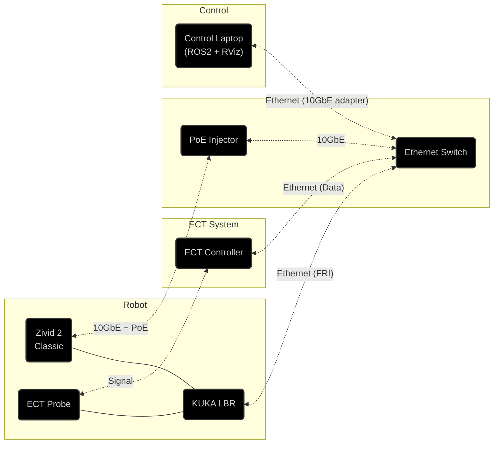
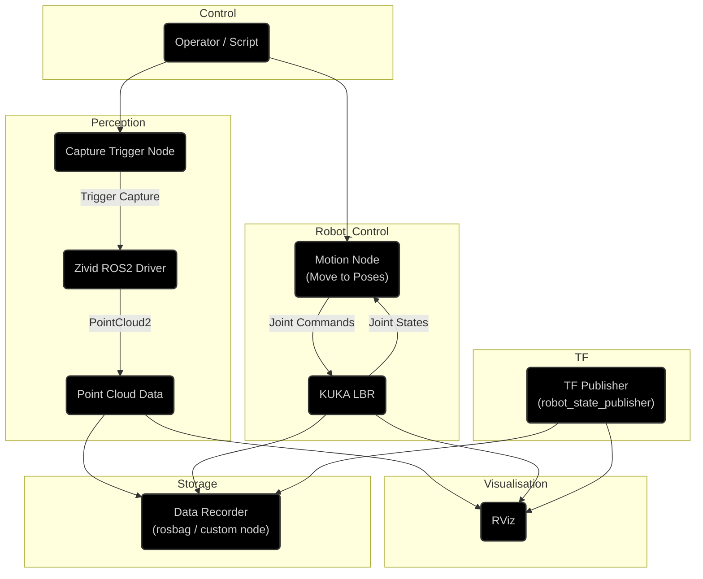

# BAE_systems_docs
Documentation for BAE_systems project, including flow charts and equipment

# Hardware

```mermaid
flowchart LR

    subgraph "Robot"
        direction TB

        hlbr("KUKA LBR")
        hzivid("Zivid 2<br>Classic")
        hectprobe("ECT Probe")

        %% Mounting relationships
        hzivid --- hlbr
        hectprobe --- hlbr
    end

    subgraph "ECT System"
        direction TB

        hectctrl("ECT Controller")
        hectprobe <-. "Signal" .-> hectctrl
    end

    subgraph "Network"
        direction TB

        hswitch("Ethernet Switch")
        hpoe("PoE Injector")
    end

    subgraph "Control"
        direction TB

        hlaptop("Control Laptop<br>(ROS2 + RViz)")
    end

    %% Connections

    %% Robot & ECT to network
    hlbr <-. "Ethernet (FRI)" .-> hswitch
    hectctrl <-. "Ethernet (Data)" .-> hswitch

    %% Zivid via PoE injector
    hzivid <-. "10GbE + PoE" .-> hpoe
    hpoe <-. "10GbE" .-> hswitch

    %% Laptop connection
    hlaptop <-. "Ethernet (10GbE adapter)" .-> hswitch


%% Styles
classDef black color:lightgrey,fill:black,stroke:#333,stroke-width:2px

class hlbr,hzivid,hectctrl,hectprobe,hswitch,hpoe,hlaptop black
```

# Software

```mermaid
flowchart TB

    %% User / control layer
    subgraph Control
        direction TB
        user("Operator / Script")
    end

    %% Robot control
    subgraph Robot_Control
        direction TB

        motion("Motion Node<br>(Move to Poses)")
        robot("KUKA LBR")

        motion -->|Joint Commands| robot
        robot -->|Joint States| motion
    end

    %% Perception
    subgraph Perception
        direction TB

        trigger("Capture Trigger Node")

        zivid("Zivid ROS2 Driver")
        pc("Point Cloud Data")

        trigger -->|Trigger Capture| zivid
        zivid -->|PointCloud2| pc
    end

    %% State / transforms
    subgraph TF
        tf_pub("TF Publisher<br>(robot_state_publisher)")
    end

    %% Visualisation
    subgraph Visualisation
        rviz("RViz")
    end

    %% Data storage
    subgraph Storage
        recorder("Data Recorder<br>(rosbag / custom node)")
    end

    %% Control flow
    user --> trigger
    user --> motion

    %% Data flow to storage
    pc --> recorder
    robot --> recorder
    tf_pub --> recorder

    %% Visualisation inputs
    pc --> rviz
    robot --> rviz
    tf_pub --> rviz


%% Styles
classDef black color:lightgrey,fill:black,stroke:#333,stroke-width:2px

class user,motion,robot,trigger,zivid,pc,tf_pub,rviz,recorder black
```
